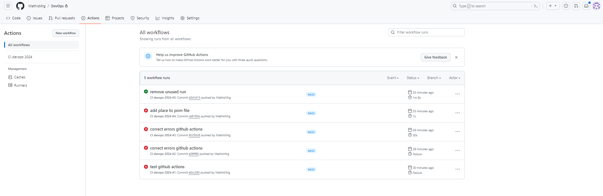
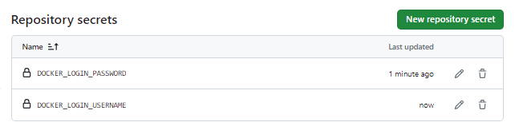

# GitHub Actions

commands

sudo apt install maven
mvn clean verify

Secured Variables, why?

Results:
[INFO] 
[INFO] Tests run: 13, Failures: 0, Errors: 0, Skipped: 0
[INFO] 
[INFO] 
[INFO] --- maven-failsafe-plugin:2.22.2:verify (default) @ simple-api ---
[INFO] ------------------------------------------------------------------------
[INFO] BUILD SUCCESS

What is it supposed to do?
Unit tests? Component tests?

2-1 What are testcontainers?

2-2 Document your Github Actions configurations.

https://github.com/MathisMrg/DevOps/actions

Secured Variables, why?

https://github.com/MathisMrg/DevOps/settings/variables/actions

