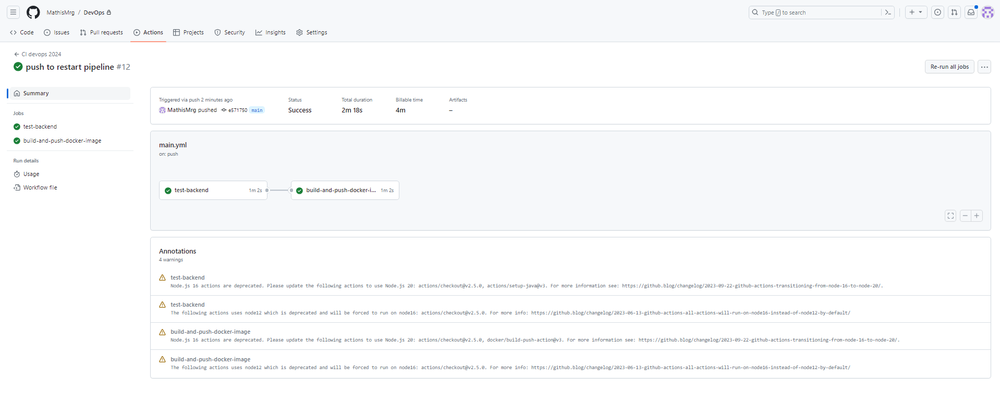
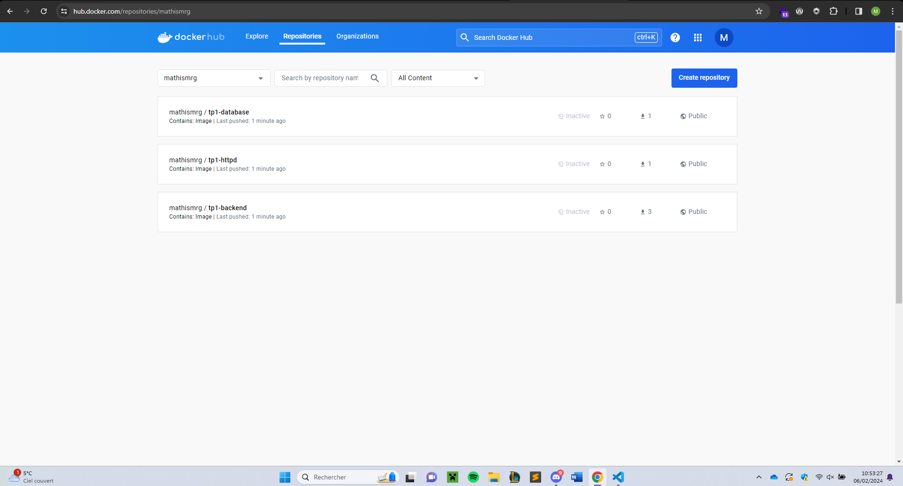
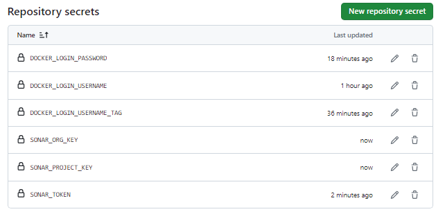
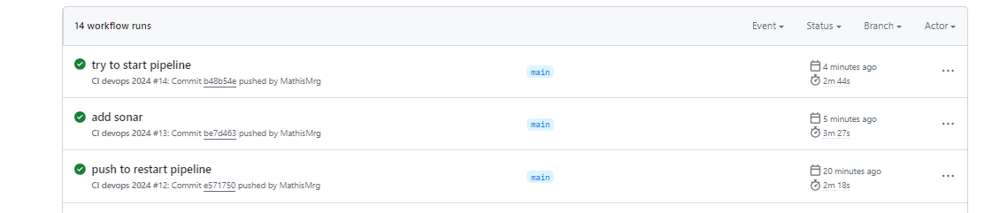
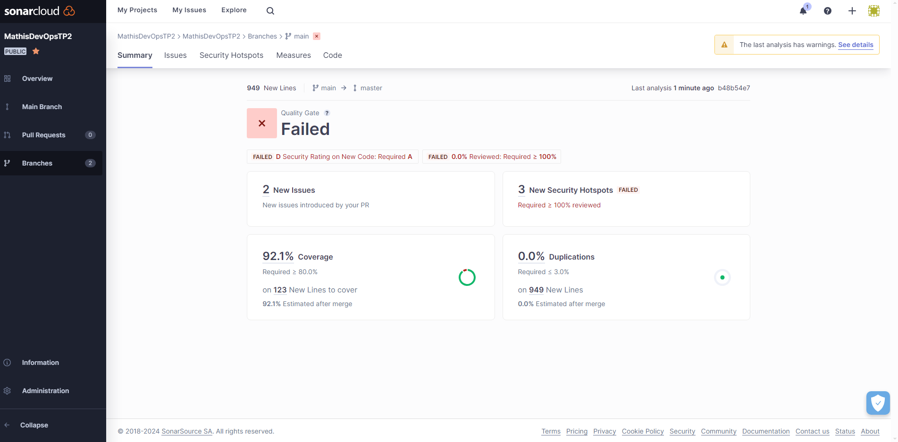

# GitHub Actions

## Test de la commandes MVN clean sur mon env

```cmd
sudo apt install maven
mvn clean verify
```

Results:

[INFO] 

[INFO] Tests run: 13, Failures: 0, Errors: 0, Skipped: 0

[INFO] 

[INFO] --- maven-failsafe-plugin:2.22.2:verify (default) @ simple-api ---

[INFO] ------------------------------------------------------------------------

[INFO] BUILD SUCCESS

### Question : Secured Variables, why?

Les variables sécuriser permettent de ne pas mettre ses mots de passe ou login en claire dans le main.yml partie CI. Cela permet donc de la sécuriter.

### Question : What is it supposed to do? (mvn clean verify)

La commande mvn clean verify permet de clean les anciennes sources, de build les sources java dans le dossier target. Il se base sur le pom.xml et passe également les test unitaire si ils sont mis en place

### Question : Unit tests? Component tests?

Les tests de composants impliquent de tester chaque objet ou partie du logiciel séparément. Les tests unitaires impliquent de tester des programmes ou des modules individuels pour l'exécution du programme.

### Question : 2-1 What are testcontainers?

Testcontainers est une bibliothèque de tests qui permet d'amorcer des tests d'intégration avec des services réels enveloppés dans des conteneurs Docker. On peut écrire des tests sans simulations ni services en mémoire.

## GitHub Actions

### Question : 2-2 Document your Github Actions configurations.

 // TODO
cf github actions workflow main.yml

Lien vers les actions : https://github.com/MathisMrg/DevOps/actions

### Image de la première CI passé


Lien vers les variables : https://github.com/MathisMrg/DevOps/settings/variables/actions

### Image des variables dans les parametres


### Question : Why did we put needs: build-and-test-backend on this job? Maybe try without this and you will see!

Le needs permet de dire que le build-and-test-backend est necessaire de à passer avant de pouvoir pousser les dockers. Dans le cas ou le build marche l'etapes d'apres n'est donc meme pas pris en compte, ca evit de pousser de version qui ne marche pas

### image de ci avec docker push valide


### imge des images docker deposer sur dockerhub


### Question : For what purpose do we need to push docker images?

 // TODO

### image d'ajout des keys sonar 


### Question : Document your quality gate configuration.

 // TODO

### imgae de sonar ci passed


### imgae de Sonar code review


## Bonus

