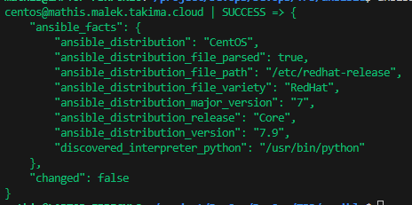
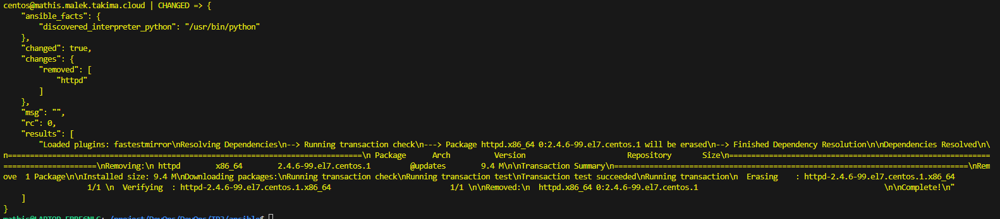
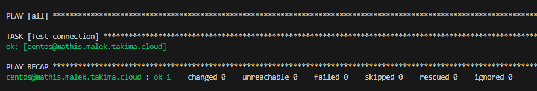
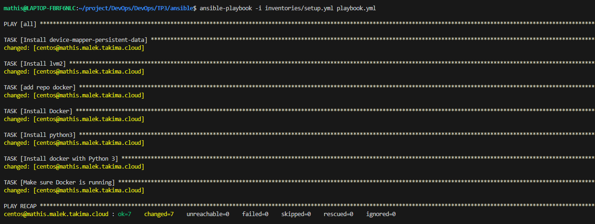
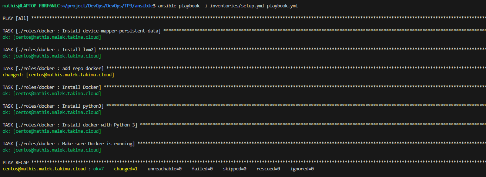

# Ansible

ansible all -i inventories/setup.yml -m ping

ansible all -i inventories/setup.yml -m setup -a "filter=ansible_distribution*"

ansible all -i inventories/setup.yml -m yum -a "name=httpd state=absent" --become

### Question : 3-1 Document your inventory and base commands

- (cf. ansible/inventories/setup.yml)

ansible-playbook -i inventories/setup.yml playbook.yml

### Install Docker with playbook

ansible-galaxy init roles/docker
- Role roles/docker was created successfully

### Question : 3-2 Document your playbook
- (cf. ansible/playbook.yml)

### Call the docker role from your playbook to check your refactor and your installation.
- On va dans le role qui a ete creer et on deplace la task dans le folder tasks du role
- Dans le playbook on appel le role
- On relance la commande playbook
