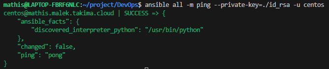
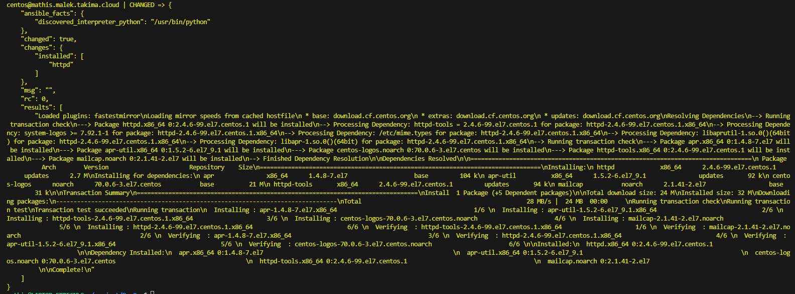

# Ansible

## TD

```sudo apt install ansible```

```ansible --version```

  - ansible 2.10.8
  - python version = 3.10.12 (main, Nov 20 2023, 15:14:05) [GCC 11.4.0]

```chmod 400 ./id_rsa ```

```ssh -i ./id_rsa centos@mathis.malek.takima.cloud```
```exit```

```sudo mkdir ansible```
```sudo touch /etc/ansible/hosts```
```sudo nano /etc/ansible/hosts``` 
```cat /etc/ansible/hosts```
- centos@mathis.malek.takima.cloud

```ansible all -m ping```
- dont work because he dont have th essh key

```ansible all -m ping --private-key=./id_rsa -u centos```


```ansible all -m yum -a "name=httpd state=present" --private-key=./id_rsa -u centos```
- dont work because we ain't root

```ansible all -m yum -a "name=httpd state=present" --private-key=./id_rsa -u centos --become```


```ansible all -m shell -a 'echo "<html><h1>Hello World</h1></html>" >> /var/www/html/index.html' --private-key=./id_rsa -u centos --become```
- centos@mathis.malek.takima.cloud | CHANGED | rc=0 >>

```ansible all -m service -a "name=httpd state=started" --private-key=<path_to_your_ssh_key> -u centos --become```


## Resultat final

